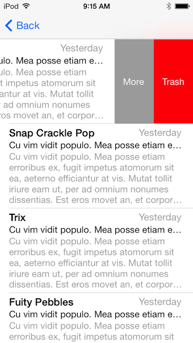

RDSwipeableTableViewCell
========================

iOS TableViewCell control that mimics the swipe behavior found the Mail App on the iPhone

## Installation

1. Add `RDSwipeableTableViewCell.h` and `RDSwipeableTableViewCell.m` to your project by dragging the two files into your XCode project
2. `#import "RDSwipeableTableViewCell.h"` 
4. Enable ARC for both files if applicable
5. Thats it!

## Documentation

`RDSwipeableTableViewCell` works right out of the box with very little configurations. 

#### RDSwipeableTableViewCell Options
- **Required** @property id&lt;RDSwipeableTableViewCellDelegate&gt; delegate
	- The object to receive swipe event messages
- **Required** @property float revealDistance
	- Represents how far the cell should scroll to reveal the hidden view(s)
- **Required** RDSwipeableTableViewCellRevealDirection revealDirection
	- Represents the direction in which the cell should scroll to reveal the hidden view(s) _(Default: None)_
- _(Optional)_ @property UITableView * tableView
	- The table view associated with the cell 
	
#### RDSwipeableTableViewCellDelegate Protocol

- -(void)tableView:willBeginCellSwipe:inDirection:
	- Called prior to revealing the hidden view, this is the best time to setup your presentation view(s)
- -(void)tableView:didCellSwipe:inDirection:
	- Called after the hidden view is visible, if you want to execute any final instructions where the user can see then this is the best time to do so.
- -(void)tableView:willBeginCellReset:
	- Called prior to hiding the revealed view.
- -(void)tableView:didCellReset:
	- Called after the hidden view is no longer visible, this is the best time to do any cleanup

The following is an example of a very basic implementation of `RDSwipeableTableViewCell`:

**UITableViewDataSource Implementation**

	- (UITableViewCell *)tableView:(UITableView *)tableView cellForRowAtIndexPath:(NSIndexPath *)indexPath
	{
    	static NSString *CellIdentifier = @"Cell";
    
    	RDSwipeableTableViewCell *cell = [tableView dequeueReusableCellWithIdentifier:CellIdentifier forIndexPath:indexPath];
    	if (!cell) cell = [[RDSwipeableTableViewCell alloc] initWithStyle:UITableViewCellStyleDefault reuseIdentifier:CellIdentifier];
    
    	cell.delegate = self;
    	cell.tableView = tableView;
    	cell.revealDirection = RDSwipeableTableViewCellRevealDirectionRight;
    	cell.textLabel.text = @"Swipe to see the hidden view";
    
    	return cell;
	}
 
**RDSwipeableTableViewCellDelegate Implemenation**
	
	- (void)tableView:(UITableView *)tableView willBeginCellSwipe:(RDSwipeableTableViewCell *)cell inDirection:(RDSwipeableTableViewCellRevealDirection)direction
	{
		//
		// Setup your presentation views here
		//
		cell.revealDistance = 75;
        [cell.revealView addSubview:…];        
	}
	
	- (void)tableView:(UITableView *)tableView didCellReset:(RDSwipeableTableViewCell *)cell
	{
		//
		// Cleanup after hidden
		//
		[cell.revealView.subviews makeObjectsPerformSelector:@selector(removeFromSuperview)];
	}

#### DEMO Project

The Hello World project provides a demonstration of how to implement `RDSwipeableTableViewCell` in a couple different ways from very simple to advance. 

## LICENSE

In summary, Have Fun & Share! For specifics see [link](LICENSE)

## Questions?

If you have any questions or comments about the tutorial please feel free to drop me a line :-).

Email: <donellesanders@gmail.com>
Follow Me: [@DonelleJr](https://twitter.com/DonelleJr)